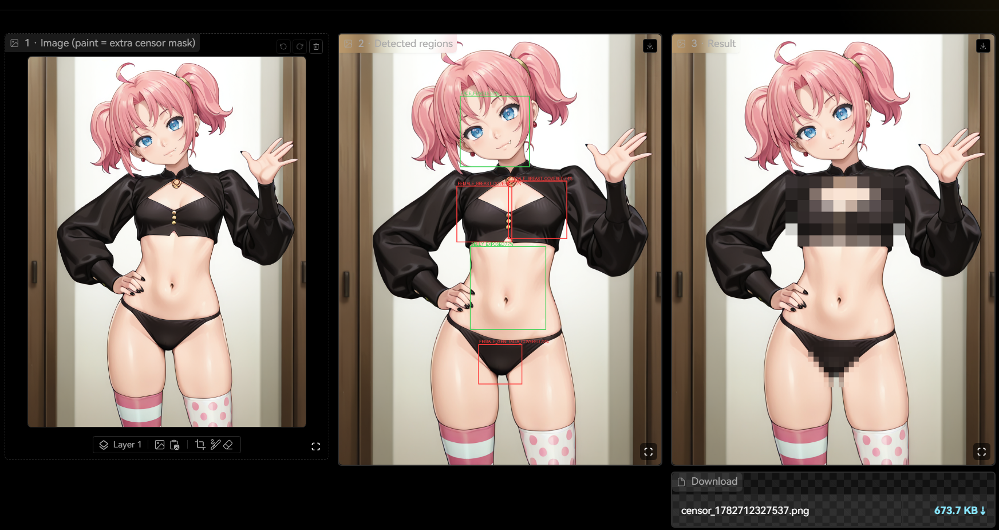
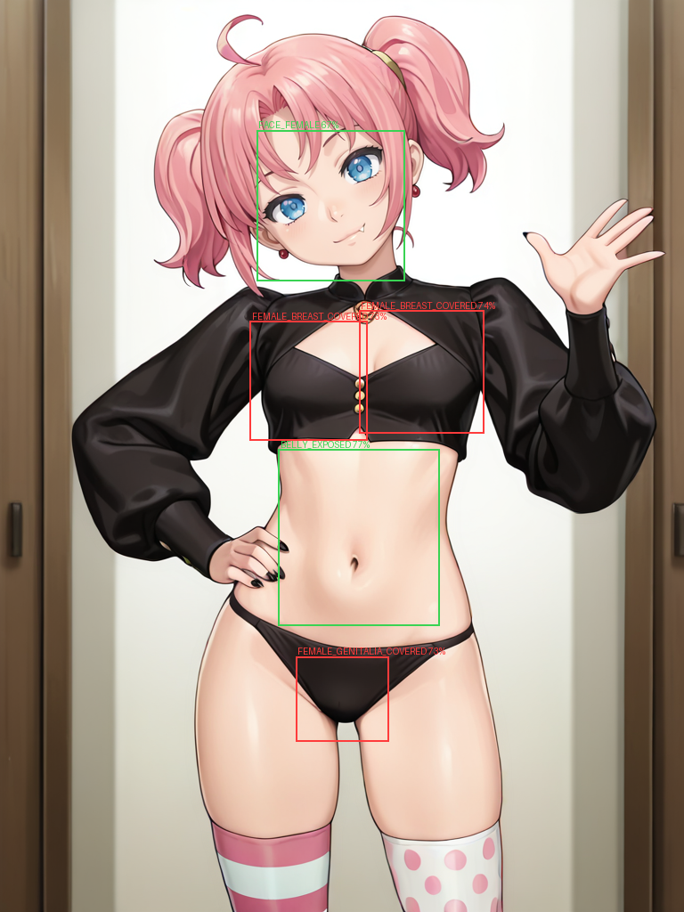
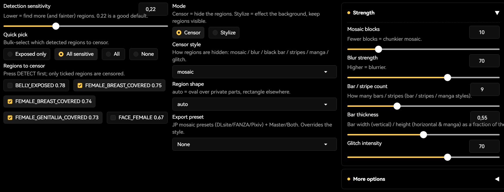
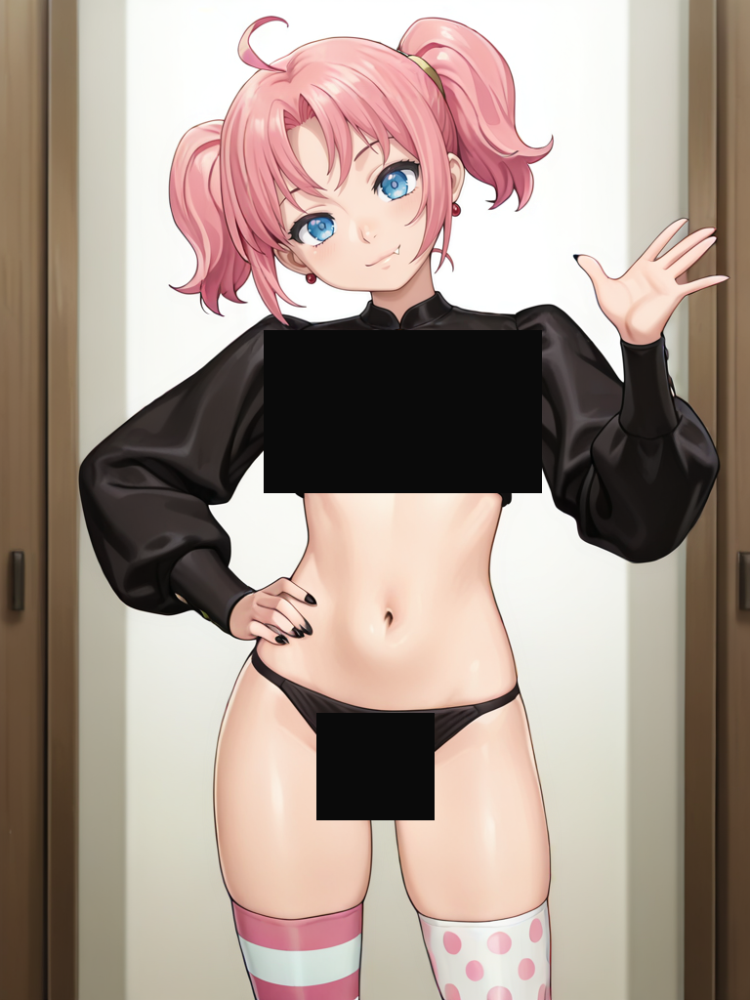
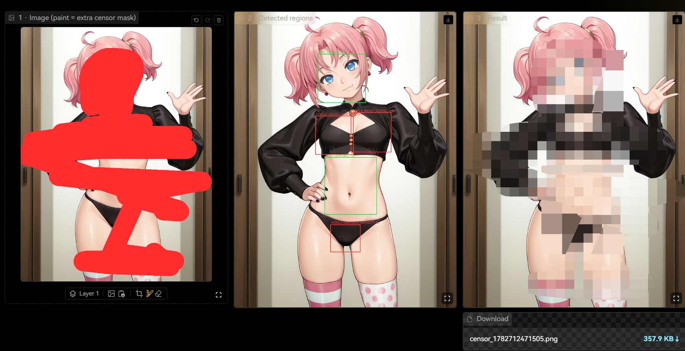
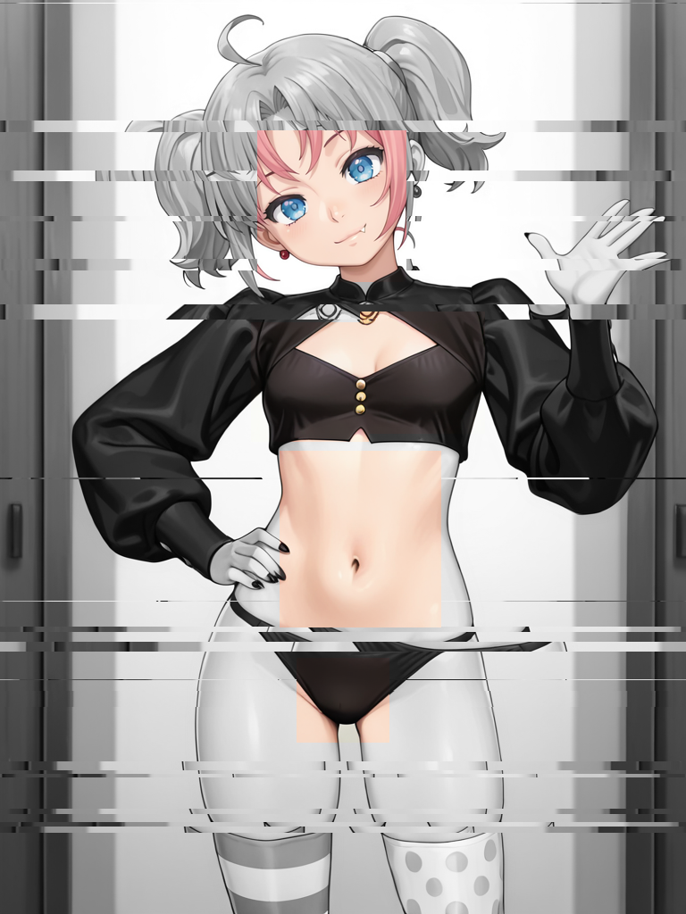
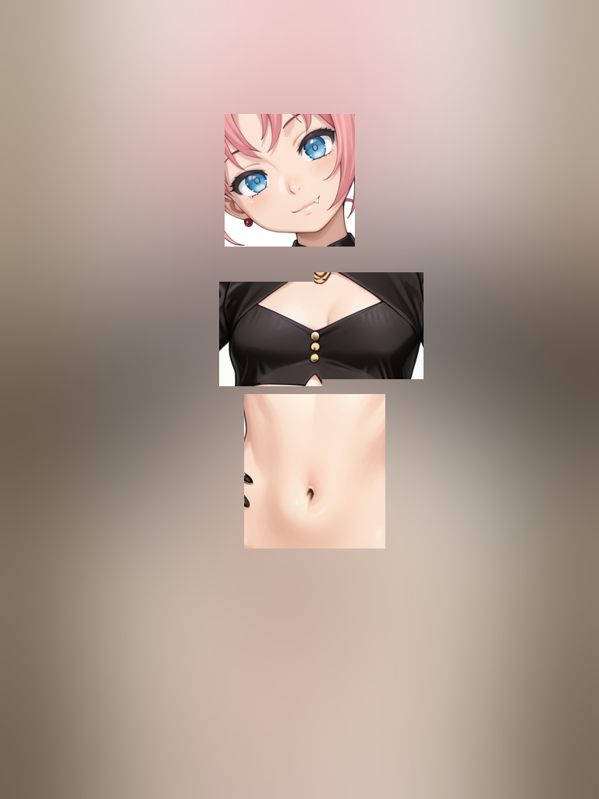
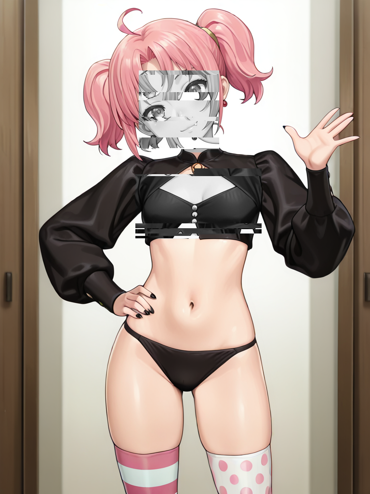

# 🔞 Auto-Censor — Stable Diffusion WebUI Forge extension

**One-click NSFW detection and censoring, built right into Forge.**
[NudeNet](https://github.com/notAI-tech/NudeNet) finds the sensitive regions, and you choose how to
hide them — mosaic, blur, black bars, stripes, manga bars, or glitch — plus a brush for custom areas,
a *stylize* mode, and Japan-compliant mosaic **export presets**. Send any txt2img / img2img result
straight to the censor tab with a single button.



---

## ✨ Features

- **Automatic detection** — NudeNet (320n ONNX, 18 body classes) draws every sensitive region and
  lists it as a checkbox. Bulk-select with one click: *Exposed only / All sensitive / All / None*.
- **7 censor styles** — mosaic, blur, black bar, vertical stripes, horizontal stripes, manga bars,
  glitch. Every style has a live strength control.
- **Smart shapes** — `auto` puts an oval over private parts and a rectangle elsewhere, or force
  rectangle / ellipse.
- **Brush mask** — paint anywhere on the image to add your own censor regions on top of the detected ones.
- **Stylize mode** — instead of hiding the regions, effect the *background* (blur / grayscale / glitch)
  and keep the regions sharp — or reverse it.
- **Export presets** — DLsite / FANZA / Pixiv mosaic-tile rules, plus Bar, Master (clean copy), and
  Both, exported at the right format and DPI.
- **Send to Censor** — a 🔞 button under every txt2img / img2img gallery drops the image into the tab.
- **Runs on your GPU** — onnxruntime with CUDA, automatic CPU fallback. The ~12 MB model is bundled.

---

## 📦 Installation

**From the Forge UI (recommended)**

1. Open the **Extensions** tab → **Install from URL**.
2. Paste:
   ```
   https://github.com/AllastorV/sd-forge-auto-censor
   ```
3. Click **Install**, then **Apply and restart UI**.

**Manual**

```bash
cd stable-diffusion-webui-forge/extensions
git clone https://github.com/AllastorV/sd-forge-auto-censor
```
Restart Forge.

> **Dependency:** detection needs `onnxruntime`. The extension installs the CPU build automatically on
> first launch. For GPU acceleration, install a matching `onnxruntime-gpu` into the Forge venv instead.
> (If you start Forge with `--skip-prepare-environment`, install `onnxruntime` manually.)

---

## 🚀 How to use

1. Open the **🔞 Censor** tab and **upload an image** — or click **🔞 Send to Censor** under any
   txt2img / img2img result.
2. Press **🔍 Detect**. Every detected region is drawn with a label and listed under *Regions to censor*.
   Use the **Quick pick** radio to bulk-select what gets censored.
3. Choose a **style** and **shape**, tune the **Strength** sliders. *(Optional: paint over the image —
   your brush stroke becomes an extra censor mask.)*
4. Press **🩹 Apply Censor**. The result appears on the right with a **Download** button.



Only the **ticked** regions are censored. On a fully-clothed image *Exposed only* may select nothing —
switch to **All sensitive** to also cover the *covered* regions.

---

## 🎛️ Controls



| Control | What it does |
|---|---|
| **Detection sensitivity** | Lower = find more (and fainter) regions. `0.22` is a good default. |
| **Quick pick** | Bulk-select detected regions: Exposed only / All sensitive / All / None. |
| **Mode** | **Censor** = hide the regions · **Stylize** = effect the background, keep regions visible. |
| **Censor style** | mosaic / blur / black bar / stripes (V/H) / manga / glitch. |
| **Region shape** | `auto` (oval on private parts, rectangle otherwise) / rect / ellipse. |
| **Strength** | Mosaic blocks, blur strength, bar/stripe count & thickness, glitch intensity. |
| **More options** | Region padding, merge gap, bar color, glitch seed, draw detection boxes + labels. |
| **Export preset** | JP mosaic presets + Bar / Master / Both (overrides the style). |

### Censor styles

| Style | Look |
|---|---|
| `mosaic` | Pixelated blocks (the classic). Fewer blocks = chunkier. |
| `blur` | Gaussian blur — strength runs from a soft haze to fully hidden. |
| `bar` | Solid colour bar over each region. |
| `barsV` / `barsH` | Vertical / horizontal stripes, image peeking through the gaps. |
| `manga` | Sliced horizontal bars with a sideways displacement, manga-style. |
| `glitch` | Chromatic shift + random slice tears. |



---

## 🖌️ Brush mask

Paint directly on the image (panel 1) to mark extra regions. The painted area is unioned with the
detected regions, so you can cover anything the detector misses — or censor an area on a clean image
with no detection at all.



---

## 🎨 Stylize mode

Switch **Mode → Stylize** to *reveal* the detected regions and apply an effect to everything else.
Pick a **Stylize effect** (glitch / grayscale / blur, or their `reverse` variants) and a single
**Stylize intensity** slider.

| | |
|---|---|
|  |  |
| **Glitch** — grayscale, torn background; regions stay in colour. | **Blur** — the background blurs away, the regions stay sharp. |

A `reverse` effect flips it — the **regions** get the effect and the background stays untouched:



---

## 🗾 Export presets

Export-ready output that follows each platform's mosaic rule. The mosaic tile is an **absolute** size
(`longest side ÷ divisor`), so a region of any size is censored to the same legal tile.

| Preset | Output | Tile rule |
|---|---|---|
| **DLsite** | Censored JPG · 300 dpi | mosaic, tile = longest ÷ 100 |
| **FANZA** | Censored JPG · 300 dpi | mosaic, tile = longest ÷ 58 (chunkier) |
| **Pixiv** | Censored PNG · 72 dpi | mosaic, tile = longest ÷ 100 |
| **Bar** | Censored PNG | solid black bars |
| **Master** | Uncensored PNG | clean archival copy, no censor |
| **Both** | Master PNG **+** Censored JPG | clean copy and a censored copy together |

Picking a preset overrides the style and writes one or more files to the **Download** box.

---

## 🔎 Detection model

`models/nudenet.onnx` (~12 MB, bundled) — NudeNet 320n, 18 classes. Runs on onnxruntime (CUDA with CPU
fallback). The class metadata drives the sensitive / exposed / ellipse / body-part handling and the
category-grouped non-max-suppression.

---

## 🗺️ Roadmap

Current build ships NudeNet detection, the full censor engine (7 styles, shapes, stylize, brush mask,
export presets), the tab, and Send-to-Censor. Planned next:

- DWPose detection (eyes / armpits / feet / soles)
- MobileSAM AI-segmentation mask shape
- Decorative shapes + manual drag editor
- Batch-folder processing

---

## 🧪 Tests

```bash
# from the extension folder, using Forge's python
venv/Scripts/python.exe tests/test_censor_engine.py    # engine: 7 styles, presets, orchestration
venv/Scripts/python.exe tests/test_nudenet_detect.py   # detector decode (no model needed)
venv/Scripts/python.exe tests/test_nudenet_smoke.py    # runs the real model
```

---

## 🙏 Credits

- [**NudeNet**](https://github.com/notAI-tech/NudeNet) by notAI-tech — the NSFW detection model.

## 📄 License

MIT — see [LICENSE](LICENSE).
